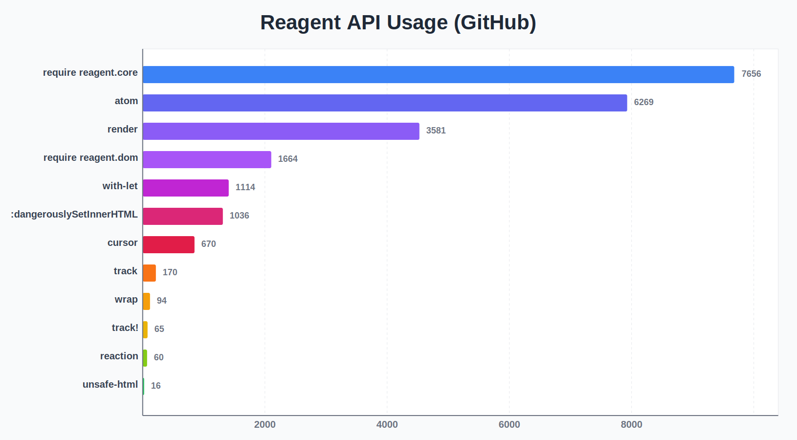

# Reagent API most used

In the process of developing [Eucalypt](https://github.com/chr15m/Eucalypt) I was interested in which parts of the [Reagent API](https://reagent-project.github.io/) are most used.
I put together these scripts to search GitHub for mentions of reagent and its API.
Obviously these numbers have a lot of caveats (some API calls are inherently more frequent) but they give interesting ballpark numbers from non-private codebases.
Hopefully this is useful to others.

See Python scripts for GitHub search/scraping of code. PRs for improving on this to get more accurate numbers are most welcome!

I would love to find a way to get "repo" counts not raw search counts, as "repos with r/atom calls" is more interesting/useful than just raw "r/atom calls".

**Update:** See below for an analysis with better data from Adrian Smith.

# Summary

## Functions

```
--- Reagent API Usage Report ---
require reagent.core      7656
atom                      6269
render                    3581
require reagent.dom       1664
with-let                  1114
:dangerouslySetInnerHTML  1036
cursor                    670
track                     170
wrap                      94
track!                    65
reaction                  60
unsafe-html               16
--------------------------------
```



## Require styles

### core

```
580   [reagent.core :as r]
264   [reagent.core :as reagent]
68    [reagent.core :as reagent :refer [atom]
26    [reagent.core :as r :refer [atom]
23    [reagent.core :refer [atom]
12    [reagent.core]
6     [reagent.core :refer [atom cursor]
4     [reagent.core :as ra]
3     [reagent.core :as reagent :refer []
2     [reagent.core :refer [adapt-react-class]
2     [reagent.core :as reagent :refer [reaction]
2     [reagent.core :as rc]
```

### dom

```
513   [reagent.dom :as rdom]
119   [reagent.dom :as rd]
111   [reagent.dom :as dom]
40    [reagent.dom]
38    [reagent.dom :as d]
28    [reagent.dom :as reagent-dom]
26    [reagent.dom.client :as rdc]
18    [reagent.dom.client :as rdom]
16    [reagent.dom.client :as rdomc]
9     [reagent.dom :as r]
8     [reagent.dom.server :refer [render-to-static-markup]
7     [reagent.dom :refer [render]
7     [reagent.dom :as r-dom]
6     [reagent.dom :as r.dom]
5     [reagent.dom.server]
5     [reagent.dom.client :as rdom-client]
4     [reagent.dom :as reagent]
4     [reagent.dom.server :as rdom]
3     [reagent.dom.server :as dom]
3     [reagent.dom.server :refer [render-to-string]
```

## Dewey SQL analysis

Adrian Smith ran the numbers using [Dewey SQL](https://blog.phronemophobic.com/dewey-sql.html):

> I was curious how these results compared to running some queries using [dewey sql](https://blog.phronemophobic.com/dewey-sql.html) ([gist](https://gist.github.com/phronmophobic/8fff02625e1dcf18fbe722180a3f7efb)). Here are my results:
> 
> ```
> ;; requires
> "reagent.core"  4,677
> "reagent.dom"     384
> 
> ;; var usages
> "atom"          7,212
> "cursor"        2,442
> "reaction"         31
> "track"           128
> "track!"           38
> "unsafe-html"       8
> "with-let"        672
> "wrap"            158
> "render"          681
> 
> "dangerouslySetInnerHTML" 446
> ```
> 
> I believe the dewey data will have fewer false positives, but potentially more false negatives.Based on what I found, I think it's likely that your render counts are inflated and probably have false positives. Same with with-let. One important caveat with `:dangerouslySetInnerHTML` is that since it's used by react, it's also used by many libraries other than reagent that wrap react. Additionally, other libraries also adopt it, even if they don't use react.
> Fwiw, you can find example usages for vars [here](https://cloogle.phronemophobic.com/name-search.html?q=reagent.core%2Ftrack%21&tables=var-usages). The web UI will only return the first 200 results, but you can download a json file with the first 10k results.
